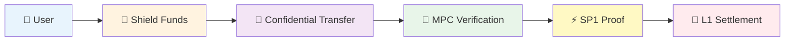

<div align="center">

# 🌟 **Halo Privacy Layer**

> **The Future of Privacy-Preserving Finance**

[](https://opensource.org/licenses/MIT)
[](https://www.typescriptlang.org/)
[](https://ethereum.org/)
[](https://github.com/halo-privacy/halo)

[🚀 **Get Started**](#-quick-start) • [📖 **Documentation**](https://docs.halo.privacy) • [💬 **Discord**](https://discord.gg/halo-privacy) • [🐛 **Report Bug**](https://github.com/halo-privacy/halo/issues)

---

</div>

## **Why Halo?**

**Halo** revolutionizes privacy in decentralized finance by enabling **confidential stablecoin transfers** while maintaining **full DeFi composability**. Unlike traditional privacy solutions that break compatibility, Halo preserves the power of programmable money while protecting user privacy.

### **What Makes Halo Special**

<table>
<tr>
<td align="center" width="33%">

### 🔐 **True Privacy**
- **Homomorphic Encryption** for confidential balances
- **Zero-Knowledge Proofs** for transaction verification
- **Client-side keys** that never leave your device
- **Selective disclosure** for compliance when needed

</td>
<td align="center" width="33%">

### **DeFi Native**
- **MetaMask compatible** - no special wallets needed
- **Full composability** with existing DeFi protocols
- **Standard EVM transactions** - works everywhere
- **Seamless integration** with your favorite dApps

</td>
<td align="center" width="33%">

### ⚡ **Production Ready**
- **100-200+ TPS** throughput (faster tps rollout)
- **<$1 per 1000 transactions** settlement cost
- **Sub-second verification** times
- **Enterprise-grade** security and compliance

</td>
</tr>
</table>

---

## **The Halo Advantage**

| Feature | Traditional Privacy | **Halo** |
|---------|-------------------|----------|
| **Composability** | ❌ Breaks DeFi | ✅ **Native Integration** |
| **User Experience** | ❌ Complex wallets | ✅ **MetaMask Compatible** |
| **Performance** | ❌ 10-50 TPS | ✅ **100-200+ TPS** |
| **Compliance** | ❌ All-or-nothing | ✅ **Selective Disclosure** |
| **Settlement Cost** | ❌ $200-500k gas | ✅ **<$1 per 1000 txs** |
| **Development** | ❌ Special SDKs | ✅ **Standard Web3** |

---

## 🏗️ **How It Works**



### 🔄 **Simple Flow**
1. **Shield** your stablecoins into confidential balances
2. **Transfer** encrypted amounts with privacy preserved
3. **Verify** through distributed MPC committee (3-of-5)
4. **Settle** on Ethereum with compressed proofs

---

## 🚀 **Quick Start**

### **Install & Run**
```bash
git clone https://github.com/halo-privacy/halo.git
cd halo
npm install
npm run setup:dev
```

### **Start the System**
```bash
# Terminal 1: Start Sequencer
cd sequencer && npm start &

# Terminal 2: Launch Beautiful CLI
cd cli && npm start
```

### **Experience Privacy**
```bash
# Choose "🌟 Interactive Terminal (Full Experience)"
# 🛡️ Shield funds with beautiful encryption
# 💫 Send confidential transfers
# 🔐 View encrypted balances
# 📦 Monitor real-time processing
```

---

## **Beautiful User Experience**

<div align="center">

### **🌟 Interactive CLI Demo**

```
    ╔══════════════════════════════════════════════════════════════╗
    ║    ██╗  ██╗ █████╗ ██╗      ██████╗     ██████╗ ██████╗      ║
    ║    ██║  ██║██╔══██╗██║     ██╔═══██╗   ██╔═══██╗██╔══██╗     ║
    ║    ███████║███████║██║     ██║   ██║   ██║   ██║██████╔╝     ║
    ║    ██╔══██║██╔══██║██║     ██║   ██║   ██║   ██║██╔═══╝      ║
    ║    ██║  ██║██║  ██║███████╗╚██████╔╝   ╚██████╔╝██║          ║
    ║    ╚═╝  ╚═╝╚═╝  ╚═╝╚══════╝ ╚═════╝     ╚═════╝ ╚═╝          ║
    ║                                                              ║
    ║              🌟 PRIVACY LAYER FOR STABLECOINS 🌟             ║
    ╚══════════════════════════════════════════════════════════════╝
```

**Features:**
- 🎨 **Stunning gradients** and animations
- 🖱️ **Interactive menus** with arrow navigation
- 📊 **Real-time monitoring** of system status
- 🔮 **Live updates** of batch processing
- ✨ **Smooth animations** for all operations

</div>

---

## 🧩 **System Architecture**

### **🔐 Light Client**
- **Twisted ElGamal** homomorphic encryption
- **Shamir's Secret Sharing** for threshold cryptography
- **Client-side** key management and encryption

### **🤝 MPC Committee**
- **3-of-5 threshold** verification
- **Distributed** without single points of failure
- **Real-time** balance verification

### **⚡ SP1 Integration**
- **Zero-knowledge proofs** for transaction validity
- **Batch aggregation** of 1000+ transactions
- **Compressed settlement** to Ethereum L1

### **🛡️ Compliance Ready**
- **Fairblock integration** for selective disclosure
- **Audit keys** generated on-demand
- **Regulatory compliance** built-in

---

## 📊 **Performance & Security**

<div align="center">

| Metric | Performance |
|--------|-------------|
| **🔄 Throughput** | 100-200+ TPS |
| **💰 Settlement Cost** | <$1 per 1000 txs |
| **⚡ Verification Time** | ~100ms |
| **🔐 Encryption Time** | ~70ms |
| **📦 Batch Size** | 1000+ transactions |

</div>

### **🔒 Security Model**
- **Cryptographic guarantees** with proven schemes
- **Threshold security** prevents single points of failure
- **Client-side encryption** keeps keys private
- **Zero-knowledge proofs** ensure transaction validity

---

## 🌐 **Network Support**

### **✅ Currently Live**
- **Ethereum Sepolia** (L1 Settlement)
- **Polygon Amoy** (L2 Execution)

### **🚀 Coming Soon**
- **Arbitrum Sepolia**
- **Optimism Sepolia**
- **Base Sepolia**
- **Scroll Sepolia**

---

## 👥 **Community & Support**

<div align="center">

### **🤝 Join Our Community**

[](https://discord.gg/halo-privacy)
[](https://twitter.com/HaloPrivacy)
[](https://github.com/halo-privacy)

</div>

### **📞 Get Help**
- **💬 Discord**: Real-time community support
- **📖 Documentation**: Comprehensive guides and API docs
- **🐛 Issues**: Report bugs and request features
- **📧 Email**: support@halo.privacy

---

## 🚀 **Ready to Build?**

<div align="center">

### **🎯 For Developers**

```typescript
import { HaloWallet, shield, transfer } from '@halo/light-client';

// Create wallet
const wallet = new HaloWallet();

// Shield funds
const encryptedBalance = await shield(amount, wallet);

// Send confidential transfer
const txHash = await transfer(to, amount, wallet);
```

### **🎨 For Users**

Experience privacy-preserving finance with our beautiful interactive CLI - no technical knowledge required!

</div>

---

## 📈 **Roadmap**

### **🎯 Version 1.1.0** (Q1 2025)
- Production Fairblock & SP1 integration
- Mainnet deployment
- Additional network support

### **🚀 Version 1.2.0** (Q2 2025)
- Performance optimizations
- Advanced compliance features
- Mobile SDK

### **🌟 Version 2.0.0** (Q3 2025)
- Cross-chain privacy transfers
- Enterprise features
- Advanced DeFi integrations

---

## 🏆 **Why Choose Halo?**

<div align="center">

### **🌟 The Only Privacy Solution That:**

- ✅ **Preserves DeFi composability**
- ✅ **Works with standard wallets**
- ✅ **Scales to production volumes**
- ✅ **Meets regulatory requirements**
- ✅ **Provides beautiful user experience**

</div>

---

<div align="center">

## 🌟 **Experience the Future of Privacy-Preserving Finance**

**[🚀 Get Started Now](#-quick-start)** • **[📖 Read the Docs](https://docs.halo.privacy)** • **[💬 Join Discord](https://discord.gg/halo-privacy)**

---

**Built with ❤️ for the future of confidential stablecoin transfers**

*Making privacy accessible, composable, and beautiful*

</div>
